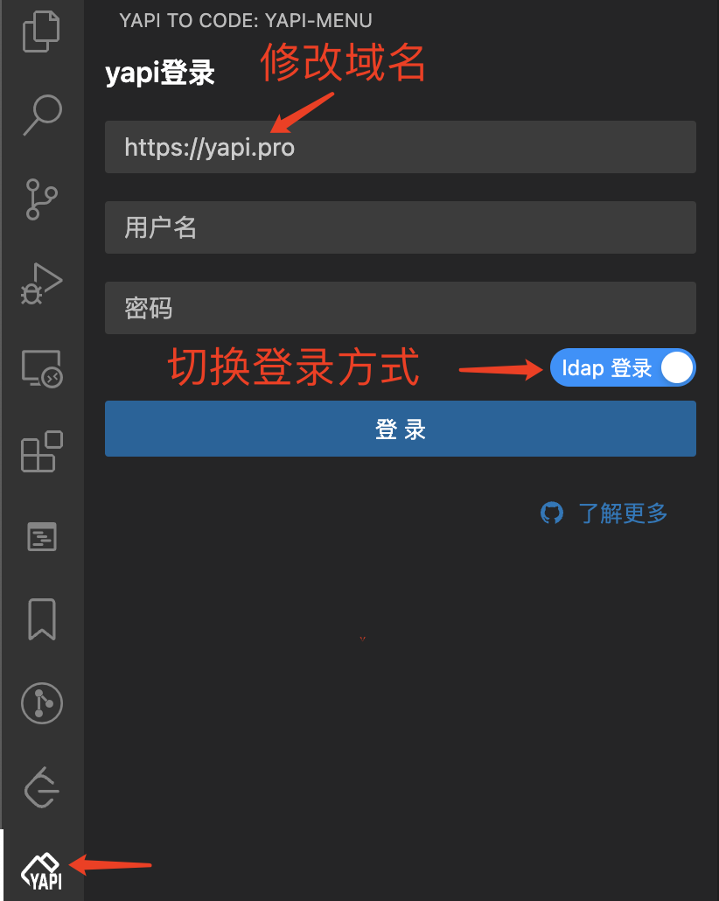
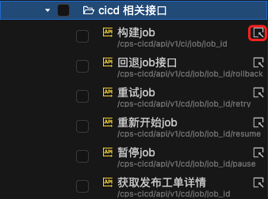
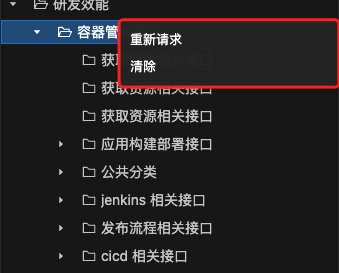
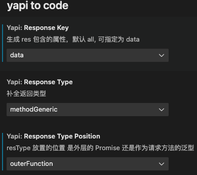
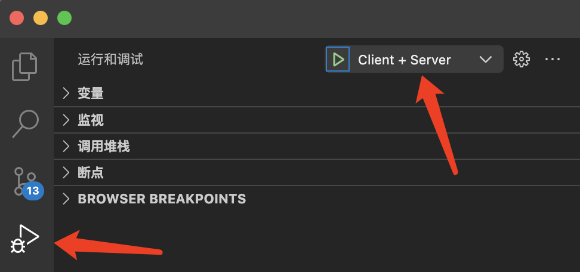

# YAPI TO CODE


[marketplace.visualstudio](https://marketplace.visualstudio.com/items?itemName=zhixiaoqiang.yapi-to-code)

## 特性

1. 🙈 0配置、开箱即用
2. 🔥 全接口预览
3. ✨ 内网可用
4. 😼 多种登录方式
5. ⚡️ 高性能
6. ✍️ 支持 js 配置自定义输出
7. ⚡️ 极速的开发体验 - Rspack
8. ...

**TODO:**

- [ ] 1. 自定义生成模版 & 切换模版预览
- [ ] 2. 项目组可选 - 加快请求 & 提高性能
- [ ] 3. 请求异步加载
- [ ] 4. 优化页面性能
- [ ] 5. 支持自定义解析
- [x] 6. yarn 替换为 pnpm
- [x] 7. 迁移到 Rspack
- [ ] 8. 函数类型检测由 `typescript` 替换为 `ts-morph`，有效减少 90% 体积
- [ ] ...

## 登录 YAPI

初次使用，输入 yapi 的服务地址 & 账号密码，进行登录



## 使用

登录后，vscode 便拥有了访问 yapi 接口的能力，能够自动把任意接口转化为类型

#### 代码诊断功能

Yapi To Code 对文档中未定义参数类型或返回值类型的接口进行波浪形警告，可以通过快速修复（quick fix）直接添加接口类型到项目中。


#### 接口浏览器

Yapi To Code 还提供了接口预览的功能，可以通过搜索选择接口对接口类型进行预览，然后把类型复制到项目中。


##### 新窗口中打开

默认接口都会在一个窗口预览，有时候需要在新窗口中预览则可以点击如下 Icon



##### 定向刷新 & 清除

有时候部分接口更新了，需要单独刷新部分的接口则可以在 tree 上按右键进行重新请求操作

清除操作仅静态删除子项内容



#### 自定义渲染

工作区配置：可以修改 输出的字段、类型填充的位置等



</br>

配置文件：`yapi-to-code.config.cjs` **优先级更高**

```js
module.exports = () => {
  return {
    // resType 放置的位置 是外层的 Promise<T> 还是作为请求方法的泛型
    // 'outerFunction' | 'fetchMethodGeneric'
    responseTypePosition: 'outerFunction',
    // 生成 res 包含的属性，默认 all, 可指定为 data
    responseKey: 'all',
    // 自定义生成 request 方法
    genRequest(
      {
        comment,
        fnName,
        IReqTypeName,
        IResTypeName,
        requestFnName,
        apiPath,
      },
      data
    ) {
      return (
        `\n${comment}\n` +
        `export async function ${fnName}(params: I${IReqTypeName}) {
          return request.${requestFnName}<${IResTypeName}>('${apiPath}', params)
        }`
      )
    }
  }
}
```

## Webview & VS Code Data Flow.png


## 开发调试

> 需要依赖 src/server src/webview 的资源

### 编译前置依赖

#### Rspack ⚡️⚡️⚡️

```bash
pnpm i
cd src/server && pnpm start
cd src/webview && pnpm start
```

#### Webpack

```bash
pnpm i
cd src/server && pnpm start
cd src/webview && pnpm start
```

### 选择 Client + Server



> Tips: node 日志在源码编辑器的调试控制台查看，webview 日志在唤起的编辑器唤起 devtool 查看

## 打包发布

> 通过 vsce 打包发布 VS Code Extension

```bash
pnpm package

pnpm pub
```
